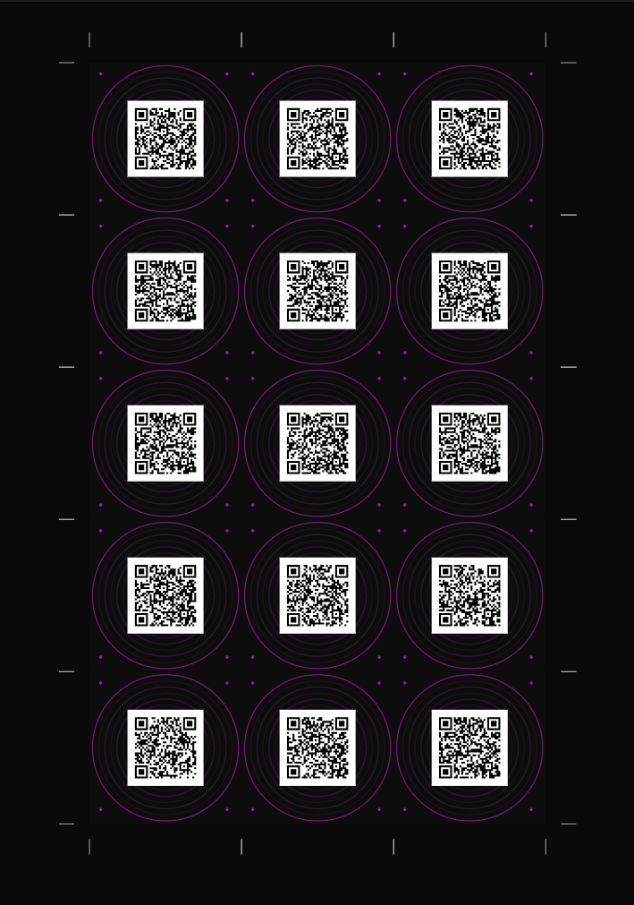
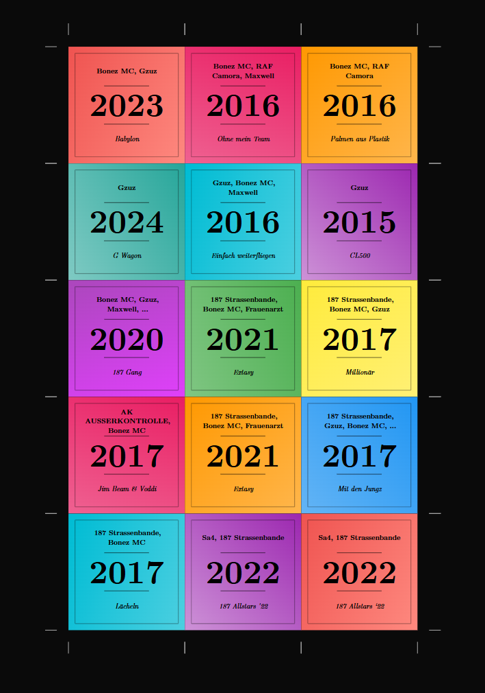

# Prompster-CLI

**Your AI agent for custom Hitster card decks.**

Prompster is a conversational AI agent that builds Hitster card decks with you — 
not for you. Describe a vibe, an era, a genre, or just a feeling. The agent asks 
follow-up questions, searches Spotify, digs through discographies and curated 
playlists, and iterates with you until the deck is exactly right. Then it generates 
the print-ready PDF.

https://github.com/user-attachments/assets/fda4c0c5-80cd-450d-a492-51fb7dca2d9d

---

## What the cards look like

<p align="center">
  
  &nbsp;&nbsp;&nbsp;
  
</p>

**Front:** Each card has a QR code that links directly to the song on Spotify.  
**Back:** Artist, song title, and release year — in colorful designs.

Print double-sided, cut them out, and start playing.

---

## Installation

> Requires [Python 3.14+](https://www.python.org/downloads/) and [uv](https://docs.astral.sh/uv/getting-started/installation/)

```bash
# Clone the repository
git clone https://github.com/dein-user/hitster-cli.git
cd hitster-cli

# Install
uv sync
```

### Spotify setup

Prompster needs access to the Spotify API to search for songs and create playlists.

1. Create an app in the [Spotify Developer Dashboard](https://developer.spotify.com/dashboard)
2. Set the redirect URI to: `http://localhost:8888/callback`
3. Create a `.env` file in the project folder:

```env
SPOTIFY_CLIENT_ID=your_client_id
SPOTIFY_CLIENT_SECRET=your_client_secret
SPOTIFY_REDIRECT_URI=http://localhost:8888/callback
```

---

## Usage

```bash
prompster
```

This starts the interactive console:

```
  ██████╗ ██████╗  ██████╗ ███╗   ███╗██████╗ ███████╗████████╗███████╗██████╗
  ██╔══██╗██╔══██╗██╔═══██╗████╗ ████║██╔══██╗██╔════╝╚══██╔══╝██╔════╝██╔══██╗
  ██████╔╝██████╔╝██║   ██║██╔████╔██║██████╔╝███████╗   ██║   █████╗  ██████╔╝
  ██╔═══╝ ██╔══██╗██║   ██║██║╚██╔╝██║██╔═══╝ ╚════██║   ██║   ██╔══╝  ██╔══██╗
  ██║     ██║  ██║╚██████╔╝██║ ╚═╝ ██║██║     ███████║   ██║   ███████╗██║  ██║
  ╚═╝     ╚═╝  ╚═╝ ╚═════╝ ╚═╝     ╚═╝╚═╝     ╚══════╝   ╚═╝   ╚══════╝╚═╝  ╚═╝

  Tell me your vibe — I'll build the deck.

❯ I want a 90s Eurodance deck!
```

Just describe what kind of deck you want — Prompster takes care of the rest.

### How it works

Prompster is an AI agent that guides you through two phases:

**Phase 1 — Build the playlist**

1. Chat about your theme, vibe, era, and favorite artists. Prompster asks follow-up questions before touching Spotify.
2. The agent does thorough research: it searches tracks, digs into albums, checks artist discographies, and browses existing curated playlists — not just the first 10 results.
3. You choose how many cards you want (15 / 20 / 30 / 40 / 50).
4. Prompster creates a Spotify playlist and shares the link so you can listen.
5. Iterate freely — remove tracks, swap songs, or start over until the playlist is exactly right.

**Phase 2 — Generate cards**

Once you're happy with the playlist, say the word. Prompster generates the print-ready PDF.

### Commands

| Command        | Description                         |
| -------------- | ----------------------------------- |
| `/help`        | Show available commands             |
| `/model`       | Switch the AI model                 |
| `/reset`       | Reset the conversation              |
| `/exit`        | Exit Prompster                      |

### Agent tools

Behind the scenes, the agent can call these Spotify tools:

| Tool                       | What it does                                      |
| -------------------------- | ------------------------------------------------- |
| `search_tracks`            | Search tracks by query                            |
| `search_albums`            | Search albums by query                            |
| `search_playlists`         | Find public playlists for inspiration             |
| `get_album_tracks`         | List all tracks on an album                       |
| `get_artist_top_tracks`    | Get an artist's top tracks                        |
| `get_artist_albums`        | Browse an artist's discography                    |
| `get_playlist_tracks`      | Read tracks from any playlist                     |
| `create_playlist`          | Create a new Spotify playlist                     |
| `add_tracks_to_playlist`   | Add tracks to the playlist                        |
| `remove_tracks_from_playlist` | Remove specific tracks                         |
| `clear_playlist`           | Wipe the playlist and start over                  |
| `generate_hitster_cards`   | Render the final PDF deck                         |

---

## Printing

1. Open the generated PDF (`hitster-deck.pdf`)
2. Print **double-sided** (flip on short edge)
3. Cut the cards along the crop marks
4. Done — have fun playing!
